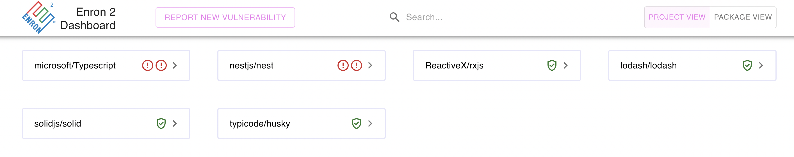
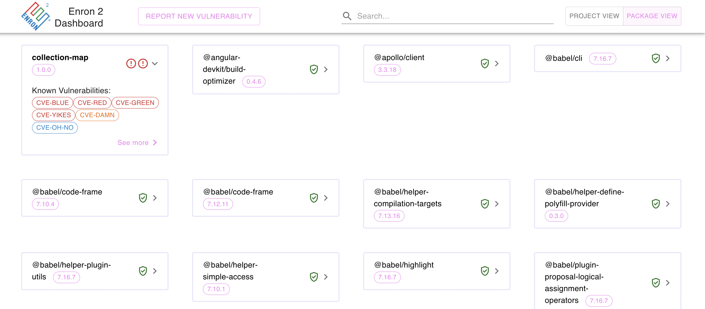
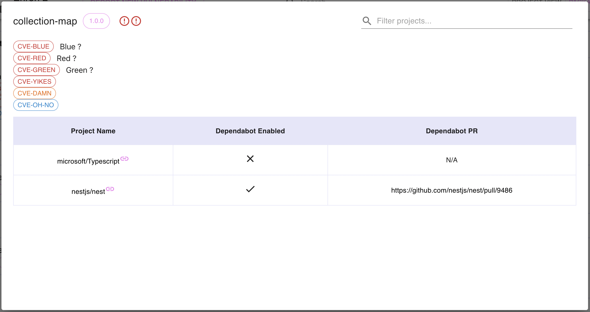
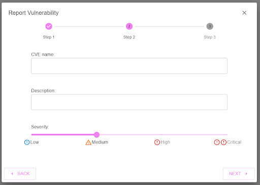
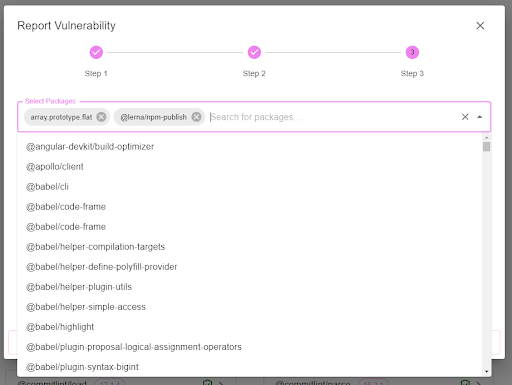

# Dashboard

This dashboard allows users to view and manage projects, packages and vulnerabilities in their github organisation.

Built in [React](https://reactjs.org/) with [Material UI](https://mui.com/).

## Features

### Project View

The project view shows projects within the organisation:

- The projects which have the most vulnerable dependencies are shown first.
- Clicking a project shows summary information on a project's vulnerable dependencies, then shows a list of all project dependencies.
- Projects can be filtered with the search bar on the top right.



### Package View

The package view shows dependencies which are used within the organisation:

- The packages which have more severe vulnerabilities are shown first.
- Clicking a package shows summary information on a package's vulnerabilities, then shows a list of all projects which are using the package.
- Packages can be filtered with the search bar on the top right.



### Dependabot

For repositories which have Dependabot enabled, the dashboard will have a direct link to the Dependabot PR for that package.



### Report Vulnerabilities

New vulnerabilities can be reported and linked to packages. These vulnerabilities will show on the dashboard after being reported.





## Directory structure

```
.
└── apps/dashboard/
    ├── src/
    │   ├── app/
    │   │   ├── components    Includes React components for the app.
    │   │   ├── services    Includes APIs for making requests to the backend.
    │   │   └── app.tsx
    │   ├── assets    Includes screenshots of app for documentation.
    │   ├── environments    Includes environment configurations for production and development.
    │   ├── favicon.ico    Icon file that is used in index.html as favicon.
    │   ├── index.html    HTML file which is served up with start script. React components are injected into the div.
    │   └── main.tsx    Entry point for react-scripts to build the app.
    ├── project.json    Holds information about the project dependencies, and web services loaded in libraries.
    └── README.md    You are reading this right now.
```
