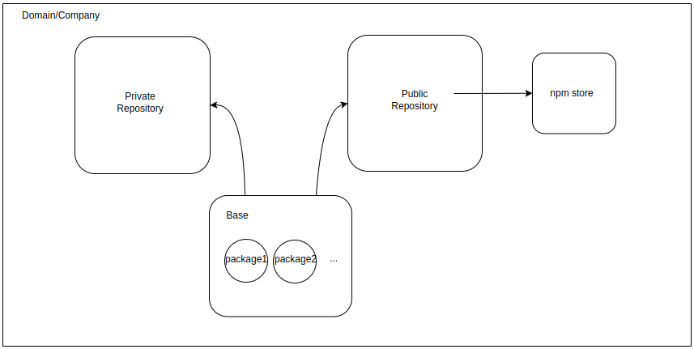

# link-webhooks

A webhook to our pipeline is created when the project is initially deployed, and a webhook linker will set up an organisation-wide GitHub webhook which our other services can subscribe to. When a new push event or pull request for the main branch is detected, those services in our pipeline will be triggered, providing a quality-of-life improvement which will remove the need for users to manually import the URLs of the projects that they want our product to handle.

How the webhook linker works:

- Triggers when a request is made to the invocation URL
- Sets up a new webhook in the GitHub organisation to the pipeline Lambda function
- Using Octokit, it makes an authenticated GitHub API call using the GitHub personal access token defined in AWS Secrets Manager.

Our solution integrates with GitHub project repositories through organisation level webhooks. We chose webhooks over Github Actions mainly because:

- It enforces the process on all repositories owned by organisation, as well as new packages and projects which may be created over time
- The process or workflow is more uniform across repositories
- The same pipeline configuration is abstracted away from each repository to reduce clutter in repositories for developers

# pipeline

The `main.ts` here mainly invokes other lambdas, namely the

- Parser
- CodeArtifact Uploader

## parser

This lambda is used to parse the package-lock file in repositories for dependencies, and update the database accordingly. It is invoked as part of the pipeline webhook and passed the link to the repository to extract from. Instead of downloading the whole repository with Octokit, it only retrieves the package-lock file.

### How it works

- A parser service marshals the contents of the retrieved package-lock file into a custom PackageLock object to better represent dependencies
- The parser then saves it into DynamoDB in the correct format

## CodeArtifact

### CodeArtifact publish webhook

This is the webhook that GitGub calls when a code on main is created or updated. It also uses Octokit in a similar fashion to the lambda above, where it retrieves the token from Secrets Manager.

#### How it works:

- Downloads the source code into the lambda’s temporary storage
- Sign in into the CodeArtifact repository
- Publish it using the npm tool

This lambda uses a custom image because we needed to use aws command line tool to log into the CodeArtifact repository. In order to do this, the lambda also gets the AWS credentials via the Secrets Manager service.

### CodeArtifact repository

This is where all the private packages/projects are stored. Moreover, CodeArtifact was configured in the below format to ensure a separation between the public and private repositories. The design has changed from the original structure, but the private repository still takes precedence according to the CodeArtifact documentation [page 42-43](https://docs.aws.amazon.com/codeartifact/latest/ug/codeartifact-user.pdf). This is because upstream repository orders are dependent on repository creation order. In the deployment of CodeArtifact, the private repository is created first, and then the public which ensures the priority we had previously is preserved. The main benefit of this is that no public packages will appear in the private repository as opposed to previously.

